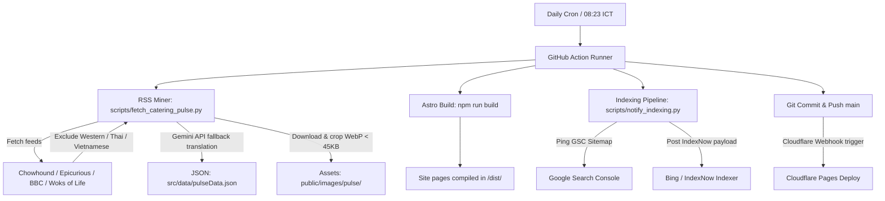

# Catering Pulse Subsystem: Autopilot Engineering Spec & Maintenance Manual

This document serves as the developer handbook and maintenance log for the dynamic Catering Pulse RSS subsystem on [ckmkh.com](https://ckmkh.com).

---

## 1. System Architecture & Data Flow

---

## 2. Key Directories & File Index

| File/Directory Path | Purpose | Key Configurations |
| :--- | :--- | :--- |
| [daily_catering_pulse.yml](file:///c:/Projects/CKM/.github/workflows/daily_catering_pulse.yml) | GitHub Actions CI/CD workflow | Cron timer (`23 1 * * *`), Node.js version (`22`), Secrets configuration |
| [fetch_catering_pulse.py](file:///c:/Projects/CKM/scripts/fetch_catering_pulse.py) | RSS scraper, AI translator, and image compressor | Gemini fallback models list, 10s cooldown pacing, 429 backoff retry counts, word count constraints |
| [notify_indexing.py](file:///c:/Projects/CKM/scripts/notify_indexing.py) | Sitemap index ping & IndexNow API submitter | Hostname, IndexNow Key (`c9b7e416a2d9426fa7406a09289196b0`), URL list scan path |
| [pulseData.json](file:///c:/Projects/CKM/src/data/pulseData.json) | The unified local database of articles | 13 structured article items (pub date, content, local image WebP reference) |
| [public/images/pulse/](file:///c:/Projects/CKM/public/images/pulse/) | Static optimized cover image storage | Remapped local WebP files (strictly under 45KB each, 16:9 ratio) |
| [CateringPulse.astro](file:///c:/Projects/CKM/src/components/CateringPulse.astro) | Landing page component (Top 3 list) | Displays first 3 items from JSON |
| [index.astro](file:///c:/Projects/CKM/src/pages/pulse/index.astro) | Pulse index list page | Lists all items with page paginator (12 items per page) |
| [[id].astro](file:///c:/Projects/CKM/src/pages/pulse/[id].astro) | Dynamic details page (Dual Slug routing) | SEO breadcrumbs, original author link EEAT, FROSTED overlay layout, rotated circular Link Juice system |

---

## 3. How to Troubleshoot & Modify

### Scenario A: Modifying the Scraper Feeds or Cuisines (變更 RSS 來源或過濾規則)

If you want to add a new feed or adjust geopolitically sensitive filters:
- **Feeds**: Go to [fetch_catering_pulse.py](file:///c:/Projects/CKM/scripts/fetch_catering_pulse.py) and update the `FEEDS` array list.
- **Filters**: Modify the list of banned keyword strings in the `is_excluded_article` method (e.g., check for Thai, Vietnamese, or Western food tokens).

### Scenario B: Customizing translation style & word length (調整翻譯語氣或文章長度)

If the client wants longer summaries or specific terminology adaptations:
- Go to [fetch_catering_pulse.py](file:///c:/Projects/CKM/scripts/fetch_catering_pulse.py) line 361.
- Edit the system instruction prompt string.
- If you increase the length requirement, make sure to adjust the **Anti-Fool Guard length check** (e.g., `len(content_km) < 450`) to match your new threshold.

### Scenario C: API Token Rotation (更換平台密鑰)

- **Gemini Key**: Add or rotate `GEMINI_API_KEY` in the repository's GitHub Settings -> Secrets -> Actions tab. Locally, update the variable in `.env`.
- **IndexNow Key**: If you rotate the IndexNow key, update `INDEXNOW_KEY` in [notify_indexing.py](file:///c:/Projects/CKM/scripts/notify_indexing.py) and ensure the new token TXT file is served at root.

### Scenario D: Node Version Upgrades (升級執行環境)

- If the Astro framework or other modules are updated in the future and require a newer Node runtime, update the `node-version` parameter under the `Set up Node.js` step in [daily_catering_pulse.yml](file:///c:/Projects/CKM/.github/workflows/daily_catering_pulse.yml) to match the new version.
